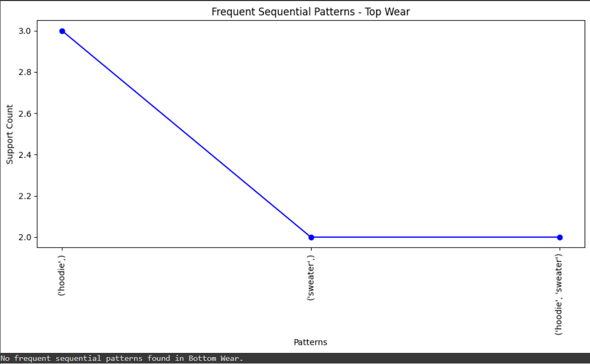

### EX3 Implementation of GSP Algorithm In Python
### DATE: 09/03/2024
### AIM: To implement GSP Algorithm In Python.
### Description:
The Generalized Sequential Pattern (GSP) algorithm is a data mining technique used for discovering frequent patterns within a sequence database. It operates by identifying sequences that frequently occur together. GSP works by employing a depth-first search strategy to explore and extract frequent patterns efficiently.
### Steps:
1. <strong>Database Scanning:</strong> GSP scans the sequence database to determine the support of each item in the dataset.
2. <strong>Candidate Generation:</strong> It generates a set of candidate sequences using frequent items found in the previous step.
3. <strong>Pattern Growth:</strong> It extends the candidate sequences by merging them to form longer patterns, checking their support against a user-defined minimum support threshold.
4. <strong>Repeat:</strong> The process continues until no new sequences meet the minimum support threshold.
<p align="justify">
GSP finds application in various domains such as market basket analysis, web usage mining, bioinformatics, and more. For instance, in retail, GSP can identify common purchasing patterns, helping businesses understand customer behavior for targeted marketing or inventory management.
</p>

### Procedure:
<p align="justify">
1. From collections import defaultdict, from itertools import combinations: Imports necessary libraries/modules. defaultdict is
used to create a dictionary with default values and combinations generates all possible combinations of a sequence.</p>
<p align="justify">
2. generate_candidates(dataset, k): Function to generate candidate k-item sequences from a dataset. It loops through each sequence in the
dataset and finds combinations of length k for each sequence, updating their counts in a dictionary.</p>
<p align="justify">
3. gsp(dataset, min_support): Function that implements the Generalized Sequential Pattern (GSP) algorithm. It iterates through increasing
sequence lengths (k) until no new frequent patterns are found. It calls generate_candidates() to find patterns of varying lengths.</p>
<p align="justify">
4. Example dataset for each category: Defines example sequences for top wear, bottom wear, and party wear categories.</p>
<p align="justify">
5. Minimum support threshold: Sets the minimum support count required for a pattern to be considered frequent.</p>
<p align="justify">
6. Perform GSP algorithm for each category: Applies the GSP algorithm for each category using the defined example datasets and the
minimum support threshold.</p>
<p align="justify">
7. Output the frequent sequential patterns for each category: Prints the frequent sequential patterns 
    along with their support counts
for each wear category.</p>
<p align="justify">
8. Visulaize the sequence patterns using matplotlib.
</p>

### Program:

```
Developed By: Senthil Kumar S
Reg No: 212221230091
```
```python
from collections import defaultdict
from itertools import combinations
# Function to generate candidate k-item sequences
def generate_candidates(dataset, k):
    candidates = defaultdict(int)
    for sequence in dataset:
        for itemset in combinations(sequence, k):
            candidates[itemset] += 1
    return {item: support for item, support in candidates.items() if support >= min_support}
# Function to perform GSP algorithm
def gsp(dataset, min_support):
    # Initialize frequent patterns dictionary
    frequent_patterns = defaultdict(int)
    k = 1
    while True:
        candidates = generate_candidates(dataset, k)
        # Prune candidates with support less than min_support
        if not candidates:
            break
        frequent_patterns.update(candidates)
        k += 1
    return frequent_patterns
#Example dataset for each category
top_wear_data = [
 ["blouse", "t-shirt", "tank_top"],
 ["hoodie", "sweater", "top"],["hoodie"],["hoodie","sweater"]
 #Add more sequences for top wear
]
bottom_wear_data = [
 ["jeans", "trousers", "shorts"],
 ["leggings", "skirt", "chinos"],
 # Add more sequences for bottom wear
]
party_wear_data = [
 ["cocktail_dress", "evening_gown", "blazer"],
 ["party_dress", "formal_dress", "suit"],
 ["party_dress", "formal_dress", "suit"],
 ["party_dress", "formal_dress", "suit"],
 ["party_dress", "formal_dress", "suit"],
 ["party_dress"],["party_dress"],
 # Add more sequences for party wear
]
#Minimum support threshold
min_support = 2
#Perform GSP algorithm for each category
top_wear_result = gsp(top_wear_data, min_support)
bottom_wear_result = gsp(bottom_wear_data, min_support)
party_wear_result = gsp(party_wear_data, min_support)
#Output the frequent sequential patterns for each category
print("Frequent Sequential Patterns - Top Wear:")
if top_wear_result:
 for pattern, support in top_wear_result.items():
  print(f"Pattern: {pattern}, Support: {support}")
else:
 print("No frequent sequential patterns found in Top Wear.")
print("\nFrequent Sequential Patterns - Bottom Wear:")
if bottom_wear_result:
 for pattern, support in bottom_wear_result.items():
  print(f"Pattern: {pattern}, Support: {support}")
else:
 print("No frequent sequential patterns found in Bottom Wear.")
print("\nFrequent Sequential Patterns - Party Wear:")
if party_wear_result:
 for pattern, support in party_wear_result.items():
  print(f"Pattern: {pattern}, Support: {support}")
else:
 print("No frequent sequential patterns found in Party Wear.")
```
### Output:


### Visualization:
```python
import matplotlib.pyplot as plt

# Function to visualize frequent sequential patterns with a line plot
def visualize_patterns_line(result, category):
    if result:
        patterns = list(result.keys())
        support = list(result.values())

        plt.figure(figsize=(10, 6))
        plt.plot([str(pattern) for pattern in patterns], support, marker='o', linestyle='-', color='blue')
        plt.xlabel('Patterns')
        plt.ylabel('Support Count')
        plt.title(f'Frequent Sequential Patterns - {category}')
        plt.xticks(rotation=90)
        plt.tight_layout()
        plt.show()
    else:
        print(f"No frequent sequential patterns found in {category}.")

# Visualize frequent sequential patterns for each category using a line plot
visualize_patterns_line(top_wear_result, 'Top Wear')
visualize_patterns_line(bottom_wear_result, 'Bottom Wear')
visualize_patterns_line(party_wear_result, 'Party Wear')
```
### Output:




### Result:

Thus the implementation of the GSP algorithm in python has been successfully executed.